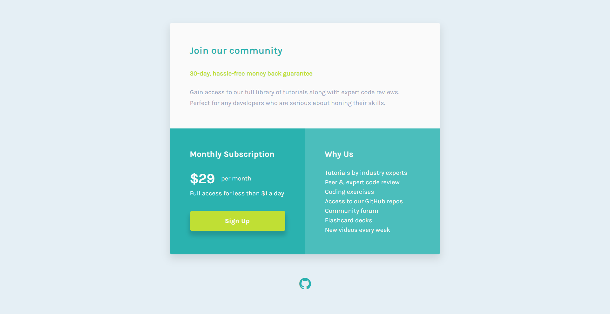

# Single Price Card Component


## Links
- [Challenge Link](https://www.frontendmentor.io/challenges/single-price-grid-component-5ce41129d0ff452fec5abbbc)
- [Site Preview](https://robinjmm-price.vercel.app/)

## About
This is my solution for the challenge of building a pricing card component from [Frontendmentor.io](https://frontendmentor.io).

The goal of the challenge is to re-create the design of a pricing card component. The solution should be as close to the design as possible.
The solution should also be responsive to different device viewports. On small screens, the elements of the component simply stack on top of each other. When viewed on larger screens, the body of the card turns into a two-column layout of equal widths.

## User Stories
The user should be able to:
- View the optimal layout for the component depending on their device's screen size
- See a hover state on desktop for the Sign Up call-to-action

## Built With
- HTML5
- CSS3
- Flexbox
- Sass
- PostCSS

## Usage
You can download the project files by clicking on the green **Code** button, then select **Download Zip**.

Once you finish extracting, open the terminal, move into the project folder, and type the following code:

```
npm install
```

This will install all the required dependencies.

To compile Sass into CSS and watch for any future changes, type the following code in your terminal:


```
npm run sass
```

To compile Sass into a minified version of CSS, run:

```
npm run prod
```

## Acknowledgement
I'm very grateful to the people at [Frontendmentor.io](https://frontendmentor.io) for providing designs and challenges that help me improve my skills as a web developer.

